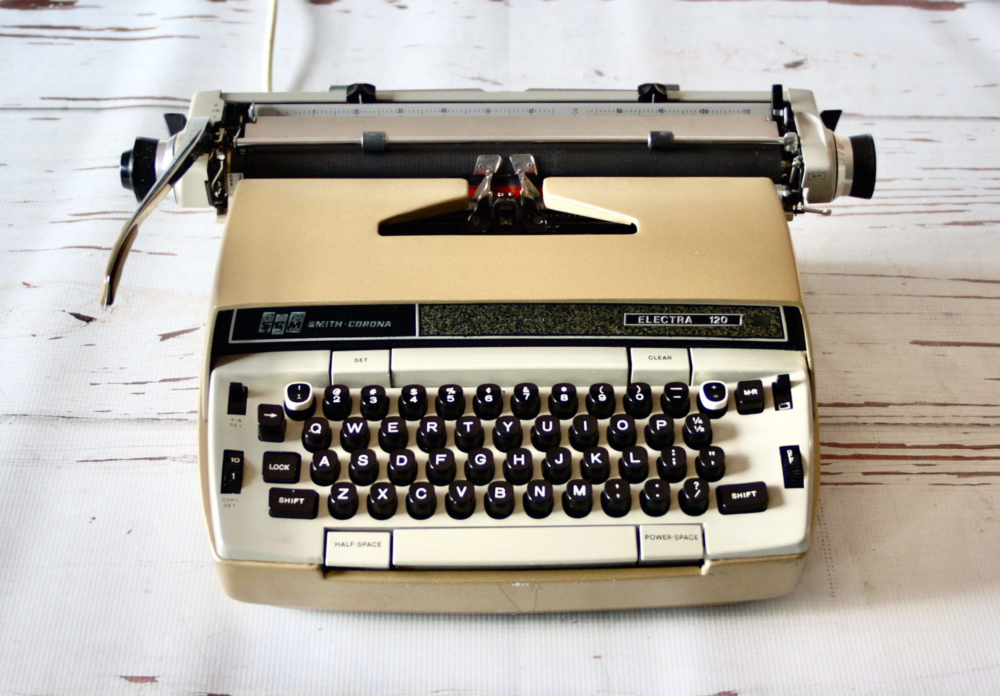

# Coding as a Manual Labor

> What the hand does the mind remembers. - Maria Montessori

This is an approximation of the typewriter I used in school, purchased when a sophomore in high school and used throughout college and graduate school.

Many my age or just younger will recall the purchase of a Commodore or Apple in the very early days of personal computing in the 1980s.  I had no such luck.

But what I lacked in access to 'technology' I, in some ways, made up for by learning to type and type fast.

In coding, keyboarding, i.e., the manual effort to put code to text, is, for most mere mortals, an essential skill -- __essential__ as in, "You may not think it important, but it makes a gargantuan difference in your coding work."

You'll often hear the term __source code__.

That's the code you, the programmer, must write/type.  And you'll be doing a ___lot___ of that.

The benefit of learning the basic finger:key mappings is one you cannot appreciate until you have both a great deal to do and merely __hunt and peck__ skills.

Moreover, you'll be less hesitant to test and re-test coding tests, drills, experiments, whatever.

Finally, coding is a manual labor as much as a mental one.  You learn by your tactile sense as well as your sense of design and your aptitude for problem-solving.

