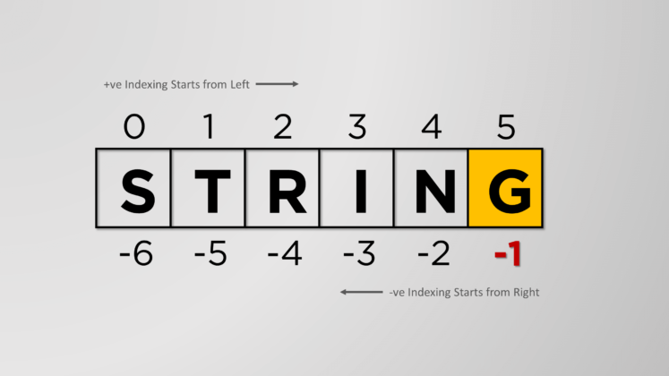

# String Introduction

## Start with a three-character string

```python
"cat"
```

The conceptual mistake you might make is to think of this as the word _cat_.  True, it has that property.  But a `string` is merely a **_container_** of characters _strung_ together.  That is, it **contains** characters, in this case `c` and `a` and `t`.

But it might as well contain a whole book: `In the beginning, God created ...`

What do we mean by _container_?

Envision something like this:

> `| [c] [a] [t] |`

but defined and known by the syntax `"cat"`.

In fact, either the double (`""`) or single (`''`) quotation marks act as a sort of wall that instructs the Python interpreter to treat these characters as the contents of a string.

## Data Containers

Python has several of container types. Right now we are focusing on `strings`. But it has `lists`, `dictionaries`, `sets`, `tuples`, and on and on. Each has advantages and each has peculiar features.

In any given container type you look for basic things it can do.  Some give you the ability to perform all four basic operations on data:

- __C__ reate data
- __R__ ead data
- __U__ pdate data
- __D__ elete data

or `CRUD` operations.

Not all container types provide all four features. Nonetheless they **_all_** have the ability to **_create_** and **_read_** the data stored.

## Reading from a String

So how do you read from a string? That is, it's one thing to get the whole `string`, but many times you want a particular character or range of characters, not the entire object.

For that you need a **window** into the container.

What does a window look like?

**Well not . . .**

```python
# Nope
"cat"( )
```

**Nor this . . .**

```python
# Yeah, no
"cat"{ }
```

**But this**

```python
"cat"[ ]
# where the 'window' square brackets contain an integer

```

Within that window you put an `integer` -- the index of the character's location.



For now, just think of getting one character at a time. Because the container's index values begin with `0`, in the Python `shell` you might have:

```python
>>> "cat"[0]
c
>>> "cat"[1]
a
>>> "cat"[2]
t
>>>

```

That is, if you only want a single character, just use a single integer value. **Only when you want more than a single character do you use the `[start:end]` notation with the `:` colon inserted.**

## String Concatenation

In Python, at least, strings can be "added" together using the `+` operator.

```python
>>> 'black ' + 'cat'
# black cat

```


